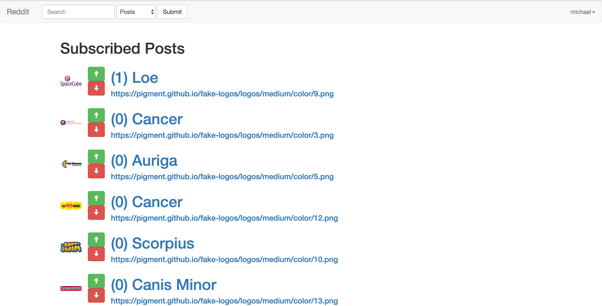
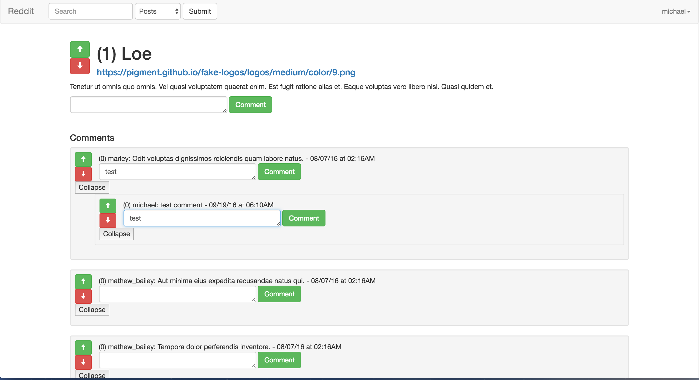
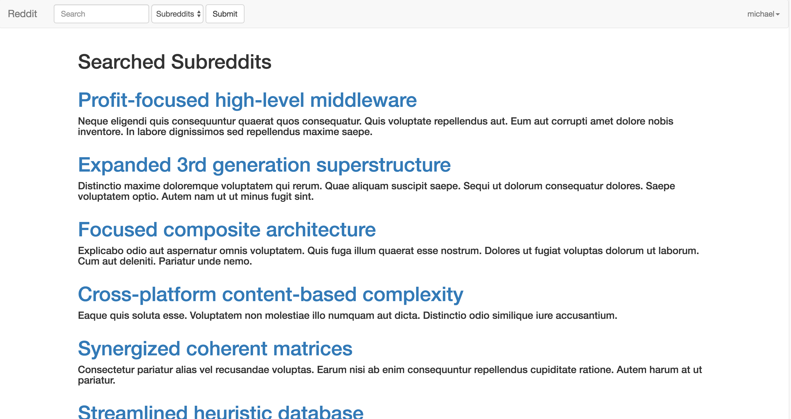

# Reddit Clone

A clone of the website Reddit build with Ruby on Rails


This application allows users to see all posts from subscribed 'subreddits'.



It features comments on post as well as nested comments and up/down votes, similar to the original website.



Users can also search for and subscribe to 'subreddits'.



## Instructions

- Clone repository
- Run ```gem install``` to handle dependencies and versions
- Run ```rails server``` to start the server
- Navigate to ```localhost:3000``` and create a user to begin
